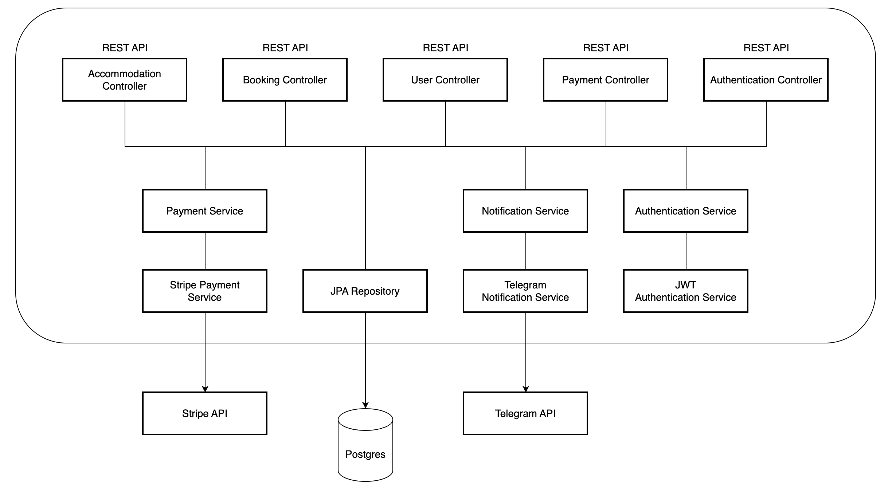
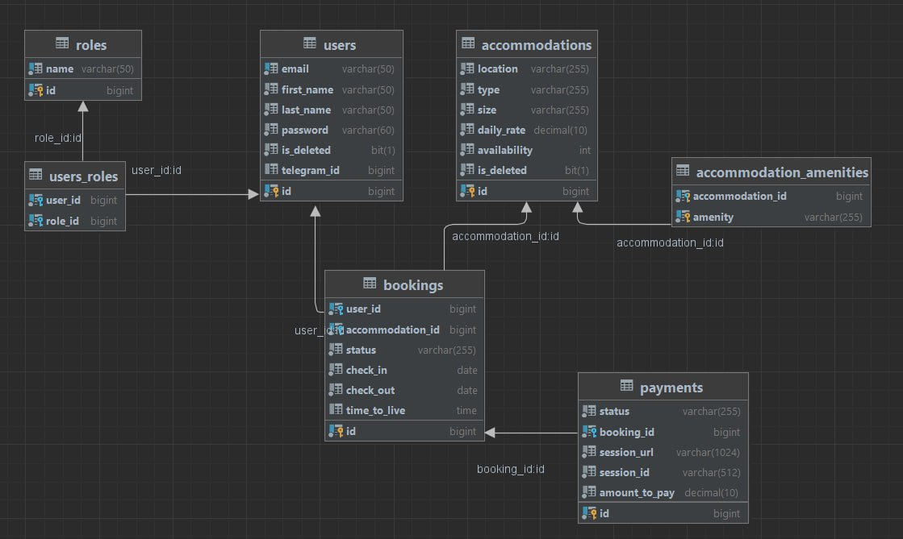

# Accommodation Booking Service

The Booking Service is an application that provides functionality for managing property rent. As a customer you can easily join, search for appropriate option, create a reservation and pay by card. As a manager, you have a lot of tools to arrange accommodations, see all bookings, payments with its status of specific user, create new accommodations and update existing ones.

### ⚡️Moreover, application provides

* automatic checking for expired bookings once a day (and sending a message to managers)
* 30 minutes to pay for created booking (otherwise it'll be cancelled)
* telegram notifications for users about creating bookings, payments and new accommodations available

## Table of Contents
* [Technologies](#technologies)
* [Architecture](#architecture)
* [Features](#features)
* [Class diagram](#class-diagram)
* [Entities](#entities)
* [Endpoints](#endpoints)
* [Configure Telegram Bot and Stripe account](#bot-stripe-config)
* [Project Launch with Docker](#project-launch-with-docker)
* [Test with Swagger on AWS](#project-swagger)

## 💻Technologies

* **Programming language:** Java 17
* **Spring Framework:** Spring Boot v3.1.5, Spring Data, Spring Security v6.1.5 (Authentication using JWT token)
* **Database Management:** PostgreSQL 42.7.0, Hibernate, Liquibase v4.20.0
* **Notification management:** Telegram bot 5.2.0
* **Payment processing:** Stripe 22.3.0
* **Testing:** JUnit 5, Mockito, TestContainers v1.19.2, PostgreSQL 42.7.0
* **Deployment and Cloud Services:** Docker 3.8, AWS
* **Additional instruments:** Maven, Lombok, Mapstruct
* **Documentation:** Swagger

## Architecture:

## Features:

### **🧑🏼Customer:**

* register in system
* log in to the system

#### 🔎Accommodation searching:
* view all available accommodations
* find exact accommodation by id

#### 🧾Booking management:
* create new booking
* view all your bookings
* find exact booking by id
* update booking
* cancel booking

#### 📂Profile management:
* view your profile
* update your profile

#### 🪪Payment management:
* create new payment
* cancel payment

#### 🔔Notifications:
* receiving telegram notification about creating booking
* receiving telegram notification about cancelling booking
* receiving telegram notification about success payment
* receiving telegram notification when new accommodation is added
* receiving telegram notification when new accommodation is available for booking

### 🧑🏼‍💻Manager:

* register in system
* log in to the system

#### In addition, you can:

#### 🏠Accommodation management:
* create new accommodation
* update existing one
* delete accommodation

#### 🧾Booking management:
* view all bookings and it's status

#### 🪪Payment management:
* view all payments all payment of specific user

### 🦸🏼‍♂️Admin:

* log in to the system
* do everything the MANAGER does

#### In addition, you can:
* update user's roles

## Entities:

1. **User** - represents any user
2. **Role** - represents user's role in app (customer, manager or admin)
3. **Accommodation** - represents any property
4. **Booking** - represents user's booking of specific property for some period
5. **Payment** - represents user's payment for booking

## Class diagram

## Endpoints:

### Authentication Controller:

| Request type | Endpoint                     | Role  | Description                                               |
|--------------|------------------------------|-------|-----------------------------------------------------------|
| POST         | /api/auth/register           | ALL   | register a new user                                       |
| POST         | /api/auth/login              | ALL   | login registered user                                     |

### Accommodation Controller:

| Request type | Endpoint                      | Role  | Description                                              |
|--------------|------------------------------ |-------|----------------------------------------------------------|
| POST         | /api/accommodations           | MANAGER/ADMIN   | create new accommodation                       |
| GET          | /api/accommodations           | ALL             | get a list of all accommodations               |
| GET          | /api/accommodations/{id}      | ALL             | get exact accommodation by id                  |
| PUT          | /api/accommodations/{id}      | MANAGER/ADMIN   | update exact accommodation by id               |
| DELETE       | /api/accommodations/{id}      | MANAGER/ADMIN   | delete exact accommodation by id               |

### Booking Controller:

| Request type | Endpoint                | Role           | Description                        |
|------------- |------------------------ |----------------|------------------------------------|
| POST         | /api/bookings           | USER           | create a new booking               |
| GET          | /api/bookings/my        | ALL            | get user's bookings                |
| GET          | /api/bookings           | MANAGER/ADMIN  | get all bookings                   |
| GET          | /api/bookings/{id}      | USER           | get user's booking by id           |
| PUT          | /api/bookings/{id}      | USER           | update user's booking by id        |
| DELETE       | /api/bookings/{id}      | USER           | delete user's booking by id        |

### Payment Controller:

| Request type | Endpoint                | Role           | Description                                      | 
|------------- |------------------------ |----------------|--------------------------------------------------|
| POST         | /api/payments           | USER           | create payment                                   |
| GET          | /api/payments/success   | ALL            | redirect endpoint after success stripe payment   |
| GET          | /api/payments/cancel    | ALL            | redirect endpoint after cancel stripe session    |
| GET          | /api/payments           | MANAGER/ADMIN  | find all payments or payment of specific user    |

### User Controller:

| Request type | Endpoint                | Role     | Description             | 
|------------- |------------------------ |----------|-------------------------|
| GET          | /api/users/me           | USER     | get user's profile      |
| PUT          | /api/users/me           | USER     | update user's profile   |
| PUT          | /api/users/{id}/role    | ADMIN    | update user's roles     |

## Configure Telegram Bot and Stripe account

* to create a telegram bot and get secret token follow this instructions: https://blog.devgenius.io/how-to-set-up-your-telegram-bot-using-botfather-fd1896d68c02
* to create Stripe account ang get it secret follow next instructions: https://paymentsplugin.com/blog/stripe-api-keys

## Project Launch with Docker

* Clone the repository from GitHub
* Create a `.env` file with the necessary environment variables (as an example for filling - .env.sample).
* Run `mvn clean package` command
* Run `docker-compose build` command to build, and `docker-compose up` to start the Docker containers
* The application should be running at http://localhost:8088. You can test the operation of the application using swagger http://localhost:8088/swagger-ui/index.html.

### Test with Swagger on AWS

Access the AWS deployment at http://ec2-3-84-128-118.compute-1.amazonaws.com/swagger-ui/index.html

If testing admin endpoints, use the following credentials:

- **Email:** admin@gmail.com
- **Password:** 123456
